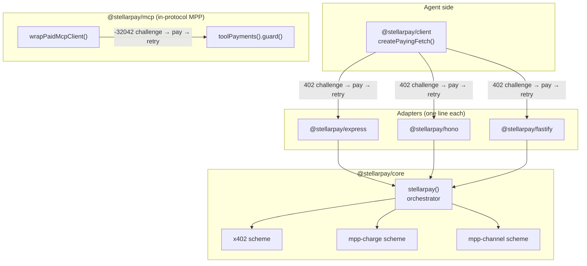

# stellarpay

**One middleware, every machine-payment protocol on Stellar.**

Gate any HTTP route with **x402**, **MPP charge**, or **MPP channel** by changing one config
field. Pay for any of them from an agent with **one client**. Monetize an **MCP server** in
one line.

Built for the Stellar hackathon (Agentic Payments track). Everything below is **testnet**
unless stated otherwise — see [Status](#status--known-facts).

## Hero: three routes, three protocols, one config

```ts
import { stellarpay } from "@stellarpay/core";

const paywall = stellarpay({
  network: "stellar:testnet",                    // preset picks facilitator URL + testnet USDC SAC
  payTo: "GBBD47IF6LWK7P7MDEVSCWR7DPUWV3NY3DTQEVFL4NAT4AQH3ZLLFLA5", // your recipient address
  mppSecretKey: process.env.MPP_SECRET_KEY!,      // required: /summarize and /ticks use mpp-*
  sponsorSecret: process.env.SPONSOR_SECRET!,     // required: /summarize sets sponsorGas
  channel: {                                      // required: /ticks uses mpp-channel
    contract: "CBIELTK6YBZJU5UP2WWQEUCYKLPU6AUNZ2BQ4WWFEIE3USCIHMXQDAMA",
    commitmentPublicKey: "GBBD47IF6LWK7P7MDEVSCWR7DPUWV3NY3DTQEVFL4NAT4AQH3ZLLFLA5",
  },
  routes: {
    "GET /weather":    { price: "$0.001" },                          // x402 (default)
    "POST /summarize": { price: "$0.01", scheme: "mpp-charge",
                         sponsorGas: true },                         // MPP, server pays fees
    "GET /ticks":      { price: "$0.0001", scheme: "mpp-channel" },  // off-chain vouchers
  },
  onPayment: (receipt) => { /* metering, dashboards, logs */ },
});
```

This is the config example from the design spec (§3), adapted to be valid against the real
`parseConfig` — `mppSecretKey`, `sponsorSecret`, and `channel` are required once a route
declares `mpp-charge`, `sponsorGas`, or `mpp-channel` respectively
(`packages/core/src/config.ts:89-109`). Verified by running it through `parseConfig` directly.

## What exists vs. what stellarpay adds

*(verbatim from the design spec, §1)*

| Existing | stellarpay adds |
|---|---|
| `@x402/express` / `@x402/hono` / `@x402/fastify` (x402 only, chain-agnostic + `@x402/stellar` scheme) | One config that also speaks MPP charge + channel per route |
| `@x402/fetch` (x402-only client), `mppx/client` (MPP-only client) | `@stellarpay/client` — auto-pays *any* 402, both protocols, with spend limits |
| Nothing | `@stellarpay/mcp` — per-tool-call payments for MCP servers |
| OZ facilitator sponsors x402 gas | Sponsored gas for MPP too (native `feePayer`), plus OZ Channels used for demo ops |

We compose, we don't reimplement: x402 protocol mechanics come from `@x402/core` +
`@x402/stellar`, MPP mechanics from `mppx` + `@stellar/mpp`, gasless submission from
`@openzeppelin/relayer-plugin-channels`. stellarpay owns the unified config, scheme routing,
receipts, and DX.

## Architecture



`@stellarpay/mcp` deliberately does **not** route through `@stellarpay/core`: MCP payments are
in-protocol MPP over `mppx`'s `Transport.mcpSdk()`, not HTTP-level x402 — an approved deviation
from the original spec sketch (see `docs/superpowers/specs/2026-07-31-stellarpay-design.md` §6
and `packages/mcp/package.json`, which has no `@stellarpay/core` dependency).

## Packages

| Package | npm | What it does | README |
|---|---|---|---|
| `@stellarpay/core` | not yet published | Config validation, route matching, scheme registry, the `stellarpay()` orchestrator | [packages/core](./packages/core/README.md) |
| `@stellarpay/express` | not yet published | One-line Express middleware adapter | [packages/express](./packages/express/README.md) |
| `@stellarpay/hono` | not yet published | One-line Hono middleware adapter | [packages/hono](./packages/hono/README.md) |
| `@stellarpay/fastify` | not yet published | One-line Fastify plugin adapter | [packages/fastify](./packages/fastify/README.md) |
| `@stellarpay/client` | not yet published | `createPayingFetch()` — auto-pays any 402 (x402 or MPP), with spend limits | [packages/client](./packages/client/README.md) |
| `@stellarpay/mcp` | not yet published | Per-tool-call payments for MCP servers (`toolPayments`) + a paying MCP client wrapper | [packages/mcp](./packages/mcp/README.md) |
| `@stellarpay/shared` | private, unpublished | Internal: network presets, price helpers, OZ Channels submission | [packages/shared](./packages/shared/README.md) |

Publishing is in progress under the `@stellarpay` npm scope — see [PUBLISHING.md](./PUBLISHING.md).

## Quickstart

**1. Install** (once published — see [PUBLISHING.md](./PUBLISHING.md); until then, clone this
repo and use the workspace packages directly via `pnpm install`):

```sh
npm install @stellarpay/core @stellarpay/express
```

**2. Configure** a paywall — one x402 route, no extra secrets needed:

```ts
import { stellarpay } from "@stellarpay/core";

const paywall = stellarpay({
  network: "stellar:testnet",
  payTo: "GBBD47IF6LWK7P7MDEVSCWR7DPUWV3NY3DTQEVFL4NAT4AQH3ZLLFLA5", // your Stellar address
  routes: {
    "GET /weather": { price: "$0.001" },
  },
});
```

**3. Gate a route** — the adapter one-liner:

```ts
import express from "express";
import { stellarpayExpress } from "@stellarpay/express";

const app = express();
app.use(stellarpayExpress(paywall));
app.get("/weather", (_req, res) => res.json({ forecast: "sunny" }));
app.listen(3000);
```

**4. Pay from an agent** — `createPayingFetch` transparently pays every 402 it hits, up to your
spend limits:

```ts
import { createPayingFetch } from "@stellarpay/client";

const payFetch = createPayingFetch({
  secret: process.env.AGENT_SECRET!, // S... testnet secret key, funded with XLM + USDC
  network: "stellar:testnet",
  limits: { maxPerCall: "$0.01", maxTotal: "$1.00" },
  onEvent: (e) => console.log(e.type), // "challenge" -> "paying" -> "paid"
});

for (let i = 0; i < 3; i++) {
  const res = await payFetch("http://localhost:3000/weather");
  console.log(await res.json());
}
```

Each iteration probes the route, gets a `402`, pays it (within the configured limits), and
retries — the second and third calls behave identically to the first; nothing is cached across
calls.

## Status & known facts

- **Testnet-first.** The `stellar:testnet` network preset pins the OZ facilitator and a
  **testnet** USDC SAC address (`packages/shared/src/networks.ts`). A `stellar:pubnet` preset
  exists structurally but mainnet hardening is still on the [roadmap](./docs/ROADMAP.md).
- **Pinned dependency versions**: `mppx` exact `0.6.31` (across `core`, `client`, `mcp`),
  `@stellar/stellar-sdk` exact `15.1.0` (workspace-wide `pnpm.overrides`) — see each package's
  `package.json`.
- **Testnet smoke script included, run with `pnpm smoke`** (`scripts/smoke.ts`) — drives one
  real x402 payment and one real mpp-charge payment against live testnet infrastructure. It has
  not been run end-to-end as part of this submission; run it yourself before a demo (see
  `.env.example` for the required vars).
- **Not yet published to npm.** All seven packages build and test from source in this
  monorepo. See [PUBLISHING.md](./PUBLISHING.md) for the exact steps to publish under the
  `@stellarpay` scope.
- **`@stellarpay/shared` is private** and intentionally never published — it's an internal,
  bundled dependency of the other packages.

## Testing

```sh
pnpm install
pnpm build
pnpm typecheck
pnpm test
pnpm smoke   # optional, live testnet — needs .env, see .env.example
```

Full testing strategy (unit, integration, smoke) is documented in the design spec, §10.

## Docs

- [`docs/modules/`](./docs/modules/) — one living doc per package (source-cited, `file:line`).
- [`docs/ROADMAP.md`](./docs/ROADMAP.md) — stretch goals beyond this submission.
- [`PUBLISHING.md`](./PUBLISHING.md) — exact npm publish steps.
- [`docs/superpowers/specs/2026-07-31-stellarpay-design.md`](./docs/superpowers/specs/2026-07-31-stellarpay-design.md) — the full design spec.

## Links

- express-api (flagship: x402 + mpp-charge + free route): <!-- filled by Plan B -->
- hono-api ("gated in minutes" proof): <!-- filled by Plan B -->
- fastify-api (minimal third-framework demo): <!-- filled by Plan B -->
- mcp-server ("Stellar Intel" paid MCP server): <!-- filled by Plan B -->
- dashboard (live receipts feed): <!-- filled by Plan B -->
- agent (Claude-API-driven buyer): <!-- filled by Plan B -->
