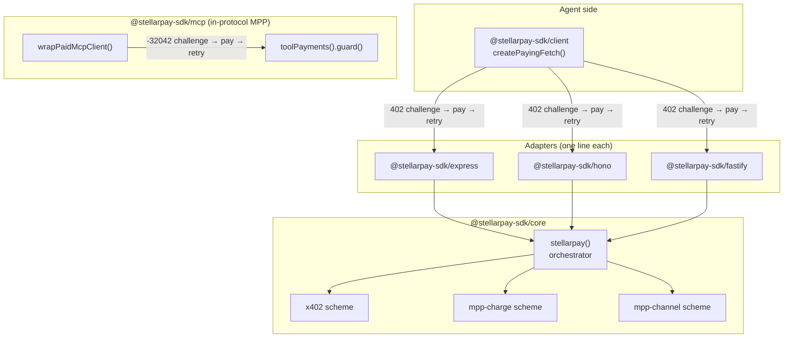

# stellarpay

**One middleware, every machine-payment protocol on Stellar.**

Gate any HTTP route with **x402**, **MPP charge**, or **MPP channel** by changing one config
field. Pay for any of them from an agent with **one client**. Monetize an **MCP server** in
one line.

Built for the Stellar hackathon (Agentic Payments track). Everything below is **testnet**
unless stated otherwise — see [Status](#status--known-facts).

## Hero: three routes, three protocols, one config

```ts
import { stellarpay } from "@stellarpay-sdk/core";

const paywall = stellarpay({
  network: "stellar:testnet",                    // preset picks facilitator URL + testnet USDC SAC
  payTo: "GBBD47IF6LWK7P7MDEVSCWR7DPUWV3NY3DTQEVFL4NAT4AQH3ZLLFLA5", // your recipient address
  facilitatorApiKey: process.env.FACILITATOR_KEY!, // required — get one free:
                                                     //   curl https://channels.openzeppelin.com/testnet/gen
  mppSecretKey: process.env.MPP_SECRET_KEY!,      // required: /summarize and /ticks use mpp-*
  sponsorSecret: process.env.SPONSOR_SECRET!,     // required: /summarize sets sponsorGas
  channel: {                                      // required: /ticks uses mpp-channel
    contract: "CBIELTK6YBZJU5UP2WWQEUCYKLPU6AUNZ2BQ4WWFEIE3USCIHMXQDAMA",
    commitmentPublicKey: "19c83c5230bddcdd492f8a301016abd839163e034ec4818b01d31fbcae3a3cde",
    // 64-hex ed25519 commitment key (raw public key bytes, not a G... address)
  },
  routes: {
    "GET /weather":    { price: "$0.001" },                          // x402 (default)
    "POST /summarize": { price: "$0.01", scheme: "mpp-charge",
                         sponsorGas: true },                         // MPP, server pays fees
    "GET /ticks":      { price: "$0.0001", scheme: "mpp-channel" },  // off-chain vouchers
  },
  onPayment: (receipt) => { /* metering, dashboards, logs */ },
});
```

This is the config example from the design spec (§3), adapted to be valid against the real
`parseConfig` — `mppSecretKey`, `sponsorSecret`, and `channel` are required once a route
declares `mpp-charge`, `sponsorGas`, or `mpp-channel` respectively
(`packages/core/src/config.ts:99-119`). `facilitatorApiKey` isn't required by `parseConfig`
itself, but the OZ testnet facilitator's `/verify`, `/settle`, and `/supported` endpoints all
require `Authorization: Bearer <key>` — omit it and the x402 route above 401s against the live
facilitator. Verified by running the full config through `parseConfig` directly.

## What exists vs. what stellarpay adds

*(verbatim from the design spec, §1)*

| Existing | stellarpay adds |
|---|---|
| `@x402/express` / `@x402/hono` / `@x402/fastify` (x402 only, chain-agnostic + `@x402/stellar` scheme) | One config that also speaks MPP charge + channel per route |
| `@x402/fetch` (x402-only client), `mppx/client` (MPP-only client) | `@stellarpay-sdk/client` — auto-pays *any* 402, both protocols, with spend limits |
| Nothing | `@stellarpay-sdk/mcp` — per-tool-call payments for MCP servers |
| OZ facilitator sponsors x402 gas | Sponsored gas for MPP too (native `feePayer`), plus OZ Channels used for demo ops |

We compose, we don't reimplement: x402 protocol mechanics come from `@x402/core` +
`@x402/stellar`, MPP mechanics from `mppx` + `@stellar/mpp`, gasless submission from
`@openzeppelin/relayer-plugin-channels`. stellarpay owns the unified config, scheme routing,
receipts, and DX.

## Architecture



`@stellarpay-sdk/mcp` deliberately does **not** route through `@stellarpay-sdk/core`'s `stellarpay()`
orchestrator or HTTP-level `parseConfig`/routing: MCP payments are in-protocol MPP over `mppx`'s
`Transport.mcpSdk()`, not HTTP-level x402 — an approved deviation from the original spec sketch
(see `docs/superpowers/specs/2026-07-31-stellarpay-design.md` §6). `packages/mcp/package.json`
does depend on `@stellarpay-sdk/core`, but only for its `dollarToDecimal` price-conversion utility
— that helper (along with `decimalToBaseUnits`/`NETWORKS`) moved out of the private
`@stellarpay-sdk/shared` package into `@stellarpay-sdk/core`'s public utility exports so the
publishable packages that need it don't depend on an unpublishable package at runtime (see
[Status & known facts](#status--known-facts)).

## Packages

| Package | npm | What it does | README |
|---|---|---|---|
| `@stellarpay-sdk/core` | [`0.1.0`](https://www.npmjs.com/package/@stellarpay-sdk/core) | Config validation, route matching, scheme registry, the `stellarpay()` orchestrator | [packages/core](./packages/core/README.md) |
| `@stellarpay-sdk/express` | [`0.1.0`](https://www.npmjs.com/package/@stellarpay-sdk/express) | One-line Express middleware adapter | [packages/express](./packages/express/README.md) |
| `@stellarpay-sdk/hono` | [`0.1.0`](https://www.npmjs.com/package/@stellarpay-sdk/hono) | One-line Hono middleware adapter | [packages/hono](./packages/hono/README.md) |
| `@stellarpay-sdk/fastify` | [`0.1.0`](https://www.npmjs.com/package/@stellarpay-sdk/fastify) | One-line Fastify plugin adapter | [packages/fastify](./packages/fastify/README.md) |
| `@stellarpay-sdk/client` | [`0.1.0`](https://www.npmjs.com/package/@stellarpay-sdk/client) | `createPayingFetch()` — auto-pays any 402 (x402 or MPP), with spend limits | [packages/client](./packages/client/README.md) |
| `@stellarpay-sdk/mcp` | [`0.1.0`](https://www.npmjs.com/package/@stellarpay-sdk/mcp) | Per-tool-call payments for MCP servers (`toolPayments`) + a paying MCP client wrapper | [packages/mcp](./packages/mcp/README.md) |
| `@stellarpay-sdk/shared` | private, never published | Internal ops helper: OZ Channels submission (`submitViaChannels`), used by `scripts/setup-demo.ts`; re-exports network presets/price helpers from `@stellarpay-sdk/core` for backward compatibility | [packages/shared](./packages/shared/README.md) |

All six publishable packages are live on npm at `0.1.0` under the **`@stellarpay-sdk`** scope
(the bare `@stellarpay` scope on npm belongs to an unrelated account). See
[PUBLISHING.md](./PUBLISHING.md) for how releases are cut.

## Quickstart

**1. Install**

```sh
npm install @stellarpay-sdk/core @stellarpay-sdk/express
```

**2. Configure** a paywall — one x402 route:

```ts
import { stellarpay } from "@stellarpay-sdk/core";

const paywall = stellarpay({
  network: "stellar:testnet",
  payTo: "GBBD47IF6LWK7P7MDEVSCWR7DPUWV3NY3DTQEVFL4NAT4AQH3ZLLFLA5", // your Stellar address
  facilitatorApiKey: process.env.FACILITATOR_KEY!, // required — get one free:
                                                     //   curl https://channels.openzeppelin.com/testnet/gen
  routes: {
    "GET /weather": { price: "$0.001" },
  },
});
```

> **Route keys take exactly two forms:** `"METHOD /exact/path"` or `"METHOD /prefix/*"`.
> Express-style `:params` are **not** supported — and this fails quietly, not loudly. The
> config validator only checks `METHOD` + a leading slash
> (`packages/core/src/config.ts:7`), so `"GET /report/:asset"` passes validation, compiles as a
> *literal* exact path (`packages/core/src/router.ts:41-48`), and never matches
> `GET /report/USDC`. The paywall then returns `undefined` for that request and **your route
> serves for free**. Use `"GET /report/*"` for parameterized paths — that's what the demo
> services do.

Three schemes, chosen per route with `scheme` (default `x402`):

| `scheme` | How it settles | Extra config it requires |
|---|---|---|
| `x402` (default) | Verified and settled through the OZ facilitator, one payment per request. Receipt carries `txHash` **and** `payer`. | `facilitatorApiKey` in practice — the OZ facilitator 401s without it |
| `mpp-charge` | Per-request MPP settlement you run yourself, signing with your own seller key. Add `sponsorGas: true` to pay the buyer's fees. Receipt carries `txHash`; MPP's wire format has no payer field, so `payer` stays unset. | `mppSecretKey`; plus `sponsorSecret` if any route sets `sponsorGas` |
| `mpp-channel` | Off-chain vouchers over an open payment channel — for high-frequency, sub-cent ticks where one on-chain settlement per request would cost more than the data. | `channel: { contract, commitmentPublicKey }` |

Both `mpp-*` schemes are **testnet-only today** and reject explicit-asset prices — use dollar
strings (`packages/core/src/config.ts:120-141`). Their replay/voucher state lives in an
in-process `Map`, so a single instance only; see the [roadmap](./docs/ROADMAP.md).

**3. Gate a route** — the adapter one-liner:

```ts
import express from "express";
import { stellarpayExpress } from "@stellarpay-sdk/express";

const app = express();
app.use(stellarpayExpress(paywall));
app.get("/weather", (_req, res) => res.json({ forecast: "sunny" }));
app.listen(3000);
```

**4. Pay from an agent** — `createPayingFetch` transparently pays every 402 it hits, up to your
spend limits:

```ts
import { createPayingFetch } from "@stellarpay-sdk/client";

const payFetch = createPayingFetch({
  secret: process.env.AGENT_SECRET!, // S... testnet secret key, funded with XLM + USDC
  network: "stellar:testnet",
  limits: { maxPerCall: "$0.01", maxTotal: "$1.00" },
  onEvent: (e) => console.log(e.type), // "challenge" -> "paying" -> "paid"
});

for (let i = 0; i < 3; i++) {
  const res = await payFetch("http://localhost:3000/weather");
  console.log(await res.json());
}
```

Each iteration probes the route, gets a `402`, pays it (within the configured limits), and
retries — the second and third calls behave identically to the first; nothing is cached across
calls.

**5. Charge per MCP tool call** — same idea, but the payment happens *inside* the MCP protocol
instead of over HTTP, so no paywall config or framework adapter is involved:

```ts
import { toolPayments } from "@stellarpay-sdk/mcp";

const payments = toolPayments({          // instantiate ONCE per process — see below
  payTo: "GBBD47IF6LWK7P7MDEVSCWR7DPUWV3NY3DTQEVFL4NAT4AQH3ZLLFLA5",
  network: "stellar:testnet",
  mppSecretKey: process.env.MPP_SECRET_KEY!,
  prices: { deep_report: "$0.02" },      // tools not listed here stay free
});

server.registerTool(
  "deep_report",
  { description: "Account forensics. Paid: $0.02 (MPP).", inputSchema: { account: z.string() } },
  payments.guard("deep_report", async ({ account }: { account: string }) => ({
    content: [{ type: "text", text: await yourForensics(account) }],
  })),
);
```

An unpaid call to a priced tool rejects with JSON-RPC `-32042` instead of running the handler;
`wrapPaidMcpClient` on the agent side answers that challenge and retries. `toolPayments()` must
be created **once per process** — its replay-protection store is in-memory, and a per-request
instance would forget every payment it has seen. One arity trap: a tool declared *without* an
`inputSchema` is invoked by the MCP SDK as `handler(extra)`, not `handler(args, extra)`, so
`guard`'s two-argument handler needs a four-line adapter — see
`examples/mcp-server/src/mcp.ts:57`. Full server and client examples:
[packages/mcp](./packages/mcp/README.md).

**Receipts.** Every settled payment — HTTP or MCP — invokes your `onPayment(receipt)` hook with
`{ scheme, route, network, amount, asset, payer?, txHash?, raw?, timestamp }`
(`packages/core/src/types.ts:25-45`). `txHash` is a real Stellar transaction hash you can look
up on Horizon; that's what the [live dashboard](#links) renders as its on-chain proof. `payer`
is only populated on `x402` (MPP's wire format carries no payer field).

## Examples

Six runnable demo services live in [`examples/`](./examples) — the same ones deployed under
[Links](#links) below:

| Directory | What it demonstrates |
|---|---|
| [`express-api`](./examples/express-api) | Flagship seller: a free route, an x402 route, and an `mpp-charge` route with sponsored gas, all in one config |
| [`hono-api`](./examples/hono-api) | "Gated in minutes" — the whole open-to-paid change is a 6-line diff |
| [`fastify-api`](./examples/fastify-api) | Third framework, minimal surface |
| [`mcp-server`](./examples/mcp-server) | Individually priced MCP tools |
| [`agent`](./examples/agent) | A Claude-driven buyer with a wallet and a hard budget that shops across all four sellers |
| [`dashboard`](./examples/dashboard) | Live SSE receipt feed with on-chain verify links |

Each has its own README; [`docs/modules/examples.md`](./docs/modules/examples.md) is the
source-cited deep dive across all six.

## Status & known facts

- **Testnet-first.** The `stellar:testnet` network preset pins the OZ facilitator and a
  **testnet** USDC SAC address (`packages/core/src/internal/networks.ts`). A `stellar:pubnet`
  preset exists structurally but mainnet hardening is still on the
  [roadmap](./docs/ROADMAP.md) — `parseConfig` already rejects `stellar:pubnet` combined with
  an `mpp-*` route, since the `mpp-charge`/`mpp-channel` schemes are currently pinned to
  testnet USDC with no per-network asset selection.
- **The x402 facilitator requires auth.** The OZ facilitator's `/verify`, `/settle`, and
  `/supported` endpoints all require `Authorization: Bearer <key>` — without one they 401.
  Set `StellarpayConfig.facilitatorApiKey` (see the hero snippet above); get a free testnet
  key with `curl https://channels.openzeppelin.com/testnet/gen`. `pnpm smoke` auto-generates
  one at startup if `SMOKE_FACILITATOR_KEY` isn't set (see `.env.example`).
- **Pinned dependency versions**: `mppx` exact `0.6.31` (across `core`, `client`, `mcp`),
  `@stellar/stellar-sdk` exact `16.2.0` (workspace-wide `pnpm.overrides`) — see each package's
  `package.json`. Bumped from `15.1.0` on 2026-08-03: live Stellar testnet emits a Soroban
  credentials XDR variant (`SorobanCredentialsType` value 2) that `15.1.0`'s bundled XDR
  can't parse; `16.2.0` knows it. `@stellar/mpp@0.7.1`'s own peer range (`^15.1.0`) is
  satisfied against the override without a hard failure — accepted deliberately (see
  `docs/modules/core.md`'s "stellar-sdk version" section for the full evidence).
- **Testnet smoke script included, run with `pnpm smoke`** (`scripts/smoke.ts`) — drives one
  real x402 payment and one real mpp-charge payment against live testnet infrastructure.
  **Both legs verified PASS against live testnet on 2026-08-03** (post `@stellar/stellar-sdk`
  16.2.0 upgrade above); confirmed wire shapes for the x402 settle response and the mpp
  `Payment-Receipt` header are recorded in `docs/modules/core.md`.
- **Published on npm at `0.1.0`** under the `@stellarpay-sdk` scope — six publishable packages
  plus one private one, all built and tested from source in this monorepo. See
  [PUBLISHING.md](./PUBLISHING.md) for how releases are cut.
- **`@stellarpay-sdk/shared` is private** and intentionally never published. It is not a runtime
  dependency of any publishable package: the network-preset and price-conversion utilities it
  used to hold now live in `@stellarpay-sdk/core`'s public exports (see the Architecture section
  above), so the six publishable packages never depend on this package at all. `shared` itself
  keeps only `submitViaChannels` (OZ Channels submission) — called by the repo-local
  `scripts/setup-demo.ts:72` to establish the demo buyer's USDC trustline fee-free — plus a
  backward-compatible re-export of the moved network/price utilities from `@stellarpay-sdk/core`.

## Testing

```sh
pnpm install
pnpm build
pnpm typecheck
pnpm test
pnpm smoke   # optional, live testnet — needs .env, see .env.example
```

`pnpm test` runs 160 tests across 30 files, covering `packages/*` and `examples/*`. Full
testing strategy (unit, integration, smoke) is documented in the design spec, §10.

## Docs

- [`docs/modules/`](./docs/modules/) — one living doc per package plus one for the demos
  (source-cited, `file:line`); [`docs/modules/README.md`](./docs/modules/README.md) routes a
  source path to its doc.
- [`docs/ROADMAP.md`](./docs/ROADMAP.md) — stretch goals beyond this submission.
- [`docs/demo-video.md`](./docs/demo-video.md) — the demo recording shot list.
- [`PUBLISHING.md`](./PUBLISHING.md) — npm release steps.
- [`docs/superpowers/specs/2026-07-31-stellarpay-design.md`](./docs/superpowers/specs/2026-07-31-stellarpay-design.md) — the full design spec.

## Links

- express-api (flagship: x402 + mpp-charge + free route): <https://express-api-production-226e.up.railway.app>
- hono-api ("gated in minutes" proof): <https://hono-api-production-415b.up.railway.app>
- fastify-api (minimal third-framework demo): <https://fastify-api-production-092a.up.railway.app>
- mcp-server ("Stellar Intel" paid MCP server): <https://mcp-server-production-d3f8.up.railway.app>
- dashboard (live receipts feed): <https://dashboard-production-5c18.up.railway.app>
- agent (Claude-API-driven buyer): <https://agent-production-d3ab.up.railway.app>

## Try it in 10 seconds

```bash
curl -i https://express-api-production-226e.up.railway.app/report/USDC/GD47GCJEFID5BZUWJHSKQR22LEIQJI55FFK3S6V4DSINUET76GRXTSEP
```

That's a real, unpaid request against the live flagship route — it comes back `402` with a
`payment-required` header carrying the raw x402 challenge (base64 JSON: `x402Version`,
`resource`, `accepts: [{ scheme: "exact", network: "stellar:testnet", amount, asset, payTo,
... }]`). Then watch it get paid for, live, on the dashboard:
<https://dashboard-production-5c18.up.railway.app> — press ▶ UNLEASH THE AGENT.
